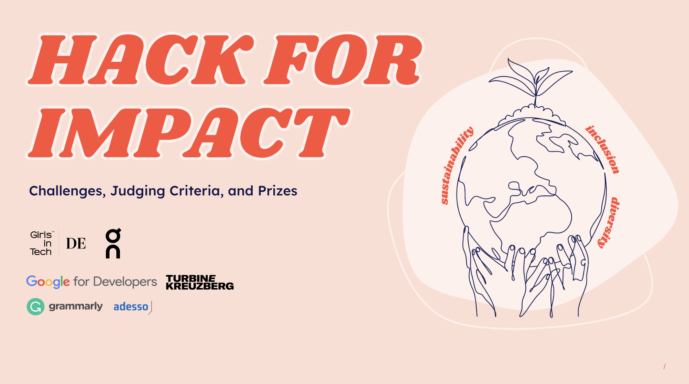

# HACKATHON Girls in Tech- Inclusive Fitness App

## Task
Everyone should be able to enjoy the power of movement in environments that feel welcoming and comfortable – regardless of your size, gender, ability status, shape, age, or ethnicity. Unfortunately, this does not reflect the fitness experience of many.

As the digital fitness industry grows, how can we use technology to create inclusive and accessible fitness environments where everyone feels seen, empowered and celebrated? 

## Solution: MyMove - No Limits

MyMOVE aims to disrupt the digital fitness industry by leveraging technology to create inclusive and accessible fitness environments that cater to diverse needs and backgrounds.
The goal is to ensure that everyone, regardless of size, gender, ability status, shape, age, or ethnicity, feels seen, empowered, and celebrated during their fitness journey.

- Personalized Inclusivity Profiles

- Adaptive Workout Programs

- Diverse Instructor Representation

These 3 points are the inspiration for MyMove.
So lets get moving!

## Masterminds!
In Alphabetical order:

### Alice Mendeleyeva
 [LinkedIn](https://www.linkedin.com/in/alice-mendeleyeva/)
 
### Camille Chapleau
[LinkedIn](https://www.linkedin.com/in/camille-chapleau/)

### Elina Usmanova
[LinkedIn](https://www.linkedin.com/in/elina-usmanova/)

### Heinke Pietsch
[LinkedIn](https://www.linkedin.com/in/heinke-pietsch-146b57159/?originalSubdomain=de)

### Hevidar Dagili
[LinkedIn](https://www.linkedin.com/in/adessihevi/?originalSubdomain=de)

### Franziska Seitz
[LinkedIn](https://www.linkedin.com/in/franziska-seitz-001b92225/)
